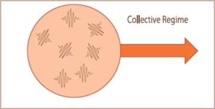

### The Kinetic Collective Model

The Kinetic Colletive Model (KCM) developed in recent years improve the solution provided under the classical RTA.
The model, derived from the exact solution of the LBTE proposed by Guyer and Krumhansl,
is based on the splitting of the collision operator in normal and resistive processes (_C_ = _N_ + _R_ ) when calculating the scattering matrix.
As normal processes does not contribute directly to thermal resistance but redistribute momentum over all the phonon distribution,
a suitable way to solve the LBTE is by using the basis that diagonalizes the normal scattering collision operator.
This diagonalization allows to solve the BTE without complicating drastically the form of the drift operator.

