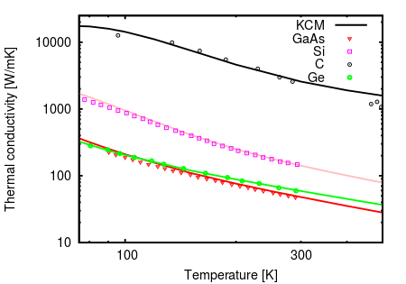

The calculations of thermal conductivty for different structures and materials
may require specific parameters, constrains, etc., for the calculations of force constants and 
relaxation times.

Here are given some tips derived from selfexperiences to easier 
the calculations of thermal conductivity. If you have any suggestion please sent an <a href="mailto:{{ "pol.torres@uab.cat" }}" title="Email me" target="_blank">email</a>
with the details and we will include your tips. 

### Calculation of force constants

For the calculation of force constants it is recomended to use a cubic conventional cell, 
as is better to produce a symmetric supercell for the calculation of the interatomic force constants.

### General calculation of thermal conductivity

The calculation of the thermal conductivity reducing to primitive cell using `--pa` option provides different
results of those obtained with a conventional cell. For instance, in diamond using the direct LBTE solution of <b>phono3py</b> (`--lbte` option),
differences up to 17% are appreciable. In the KCM calculations suchs differences are up to 8%. In the RTA these differences are
of 4%, but the underestimation of thermal conductivity is 30% of the experimental value. In contrast, for silicon such differences
are less than 3% in all cases. In both cases, calculations using `--pa` option provides values 
closer to the experimental ones. This issue can be caused for the limited 
grid sampling and its direct effect on the number of normal and umklapp processes depending on the cell.

For KCM we recommend to use primitive cell using `--pa` option. This provide better results and reduce the computational time.  

### Thermal conductivity on 2D materials

The thermal conductivity from <i> first principles </i> of 2D materials, as graphene or MoS2, requires some
considerations:
- On the calculation of force constants it is required to use a large _z_ component in order
to avoid undesired interations of the upper and lower sheet.  
- On the calculation of the thermal conductivity, the value of &kappa; is normalized by the volume of the
supercell, therefore, larger _z_ component will reduce the thermal conductivty. To compare with experiments,
the value of the thermal conductivity &kappa; provided by <i> first principles </i> has to be rescaled 
multiplying by the _z_ value used in the POSCAR and divided by the interplanar distance of the bulk material.

